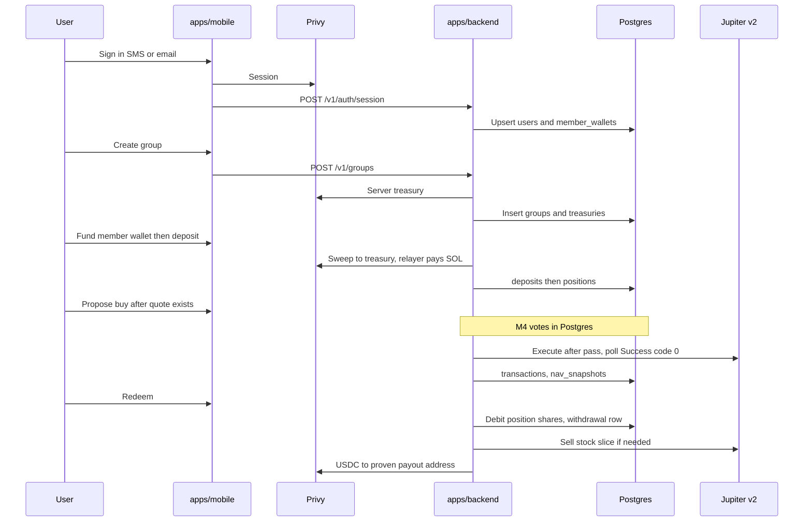

# About the planned Monaco system

This is Phase A grounding for architects. The repo today is docs plus local Postgres plumbing. `apps/backend`, `apps/mobile`, and `packages/domain` are not on disk yet. Product rules live in the root `README.md`. Build sequence lives in `docs/index.md`. This note is the traced mental model, not a type sketch.

## Overview

Monaco is an iOS app where friends pool USDC in a group treasury and buy tokenized US stocks on Solana via Jupiter. Users never manage keys or gas. Privy holds member wallets and per-group server treasuries. A Go API signs sweeps, swaps, and payouts. Postgres holds share units, votes, NAV snapshots, and P&L inputs. The app relayer pays SOL fees.

The product is leaderboards and P&L, ranked by percent return. Buys and cash-out exist so those numbers are real on-chain numbers. Fair equity uses share units, not dollar IOUs. A redeem pays the member's slice of current pot NAV in USDC. Local development uses Docker Compose Postgres only. Go and Swift talk over HTTP. There is no shared compiled package.

## Key Concepts

**Member wallet.** One Privy Solana wallet per user. Deposit inbox. Backend-signable. Shares are not credited when USDC sits here.

**Group treasury.** One Privy server wallet per group. Holds USDC and xStocks. All group trades execute from here.

**Relayer.** App fee payer in API config, not a Postgres row. M1 loads key material and fails startup if it is missing. M1 does not sign with it. M2 uses it on sweeps. M3 tickets do not name it for Jupiter.

**Share unit.** Claim ticket on the pot. Positions store ticket counts, not "Alex is owed $100."

**Pot NAV.** Dollar value of treasury USDC plus marked xStocks. M2 computes NAV from treasury USDC only. M4 adds xStock marks.

**Claim unit minting (M4).** When the pot holds marked xStock, new deposits mint `share_units` from `pot NAV / total share_units` so later members do not capture prior unrealized gain. USDC-only pot credits 1:1 in M2. UI never says "NAV" or share price. It says pot value, slice, and dollar gain or loss.

**Net USDC in.** Sweeps credited minus USDC paid out on redeems. Skip a board row when this is 0.

**Vote.** Postgres record. Go API is source of truth. No on-chain governance.

**Open decisions.** Do not pick in a sketch or in code: who may propose a buy; failed Jupiter `/execute` after a passed vote; creator leave and group dissolve.

## How It Works

### Boot and local data

`just run`, `just run backend`, and `just test backend` require Docker, reject hosted `DATABASE_URL` values, start Compose Postgres, wait on healthcheck, apply `supabase/migrations/`, then run Go. Compose project name is `monaco`. Container is `monaco-postgres`. Host port is `54322`. Migration `000001` only creates `schema_migrations`. Product tables arrive in later migrations. `just test backend` currently prints that `apps/backend` is not scaffolded and still passes the DB smoke.

### Auth, wallets, thin group in M1

Sign-in is Privy Swift: SMS and email-and-password for M1 testing. Mobile sends the Privy token to `POST /v1/auth/session`. The API verifies the token, upserts `users`, and provisions a member Solana wallet into `member_wallets` idempotently. `GET /v1/me` returns user id, display name, and member wallet address. `POST /v1/groups` inserts a thin group, name and creator only, and provisions a treasury into `treasuries`. `GET /v1/groups/{id}` returns group name and treasury address. M1 has no `group_members` table. Relayer credentials load at API start and stay idle until sweeps.

M1 login and create-group screens show Solana addresses so you can prove Privy wiring. M5 moves those addresses to Settings, Advanced.

### Deposit and sweep in M2

The user funds the member wallet. Mobile creates a `deposits` row. A poller watches member-wallet USDC through Privy and mainnet RPC. There are no Privy production webhooks. The backend signs a sweep from member wallet to group treasury. The relayer pays SOL on that transaction. After on-chain confirmation, the API sets `tx_signature` on the deposit row with **unique idempotency on signature**, then credits `positions.share_units`. Duplicate signature must not double-credit. USDC that never left the member wallet must not change position share units.

M2 increments `positions.share_units` and `amount_deposited` by the same swept USDC amount. No price formula in M2. Marked-pot claim unit minting is M4.

M2 migration also defines `withdrawals` schema. Redeem writes withdrawal rows in M4.

### Jupiter buy and sell in M3

Resolve symbol to Solana mint through `GET https://api.xstocks.fi/api/v2/public/assets/{symbol}`, then `deployments` where `network == Solana`, then `address`. USDC mint is `EPjFWdd5AufqSSqeM2qN1xzybapC8G4wEGGkZwyTDt1v`. Examples: AAPLx is `XsbEhLAtcf6HdfpFZ5xEMdqW8nfAvcsP5bdudRLJzJp`. TSLAx is `XsDoVfqeBukxuZHWhdvWHBhgEHjGNst4MLodqsJHzoB`. The xStocks API is mint metadata only. It is not an execution rail.

Quote Jupiter v2 with `inputMint` USDC and `outputMint` the xStock. Refuse if there is no route. M3 exposes a temporary stub execute-buy, group id plus symbol, no vote. Sign the treasury via Privy, `POST` Jupiter `/execute`, and poll until `status: Success` and `code: 0`. No Jupiter WebSocket. Persist group trades in `transactions` with `action` buy or sell. Idempotency is transaction signature or Jupiter execute request id on the transaction row. Cost basis columns on the transaction row use fill price, not live mark.

M3 also ships a sell rail, xStock in and USDC out, same poll rule. That rail exists so M4 redeem can liquidate a stock slice. Relayer use on Jupiter txs is not named in M3 tickets. README still says treasuries may hold no SOL.

M4 deletes the stub. After that, a passed vote is the only execute path.

### Domain. Groups, votes, NAV, redeem, boards in M4

M4 replaces the thin group with join policy, voter set, threshold, and expiry. It adds `group_members`, `proposals`, `votes`, and `nav_snapshots`. Vote statuses are `open`, `passed`, `failed`, `expired`. A proposal names an xStock from the full public catalog and a USDC amount. If Jupiter cannot quote, the UI refuses the proposal. Voters vote yes or no before expiry. Threshold is unanimous or majority among the voter set. Expiry with no pass means no swap.

Share math, vote tally, and P&L live in `packages/domain`, a Go module the API and its tests import. Handlers call one `internal/app` function per route. `app` talks to the Privy client, Jupiter client, and Postgres store. Rules stay in `packages/domain`, not scattered handler ifs. Swift does not import this module.

NAV snapshots write on deposit, transaction confirm, and withdrawal payout so boards replay from history. Do not recompute history only from live wallets. M4 pot NAV is USDC plus each xStock at mark. Ongoing marks may use Pyth Hermes. After-hours is a label when the cash equity feed is frozen.

Redeem is USDC only. Never send stock in kind.

1. Debit position share units first, row-locked in Postgres.
2. Slice is `shares redeemed / total shares × pot NAV`. If the treasury holds stock, sell that slice to USDC on Jupiter.
3. Send USDC to a payout address the user proved they own with a signed message. Persist a `withdrawals` row. Proof is required on every redeem, including partials.

Payout is current slice, not a refund of dollars deposited.

### Three boards. M4 data, M5 screens

Rank by percent return: `percent return = equity / net USDC in − 1`. Dollar P&L sits beside the name. Never rank by dollars.

- In-group member board. Members with share balance greater than zero in that group. Rank by in-group percent. Full exit from the group drops them from this board only.
- App-home group board. Groups with net USDC in greater than 0. Equity is pot NAV. A join password hides entry, not the score.
- App-home people board. One row per user with net USDC in greater than 0 across all groups. Equity is the sum of slices. Net USDC in is the sum of per-group nets.

One user belongs to many groups. That is why the people board works.

### Mobile product UI in M5

SwiftUI, iOS 18+ per the stack table and `docs/index.md`. Hand-written `Codable` models match Go JSON. Main flow copy bans wallets, gas, seed phrases, mint, and "NAV". Settings, Advanced may show explorer links. Email-and-password may remain on launch for testers. After redeem, refresh all three boards.

## Where Things Live

Planned layout from `docs/index.md`. Do not use `apps/api` or `apps/ios`.

| Path | Role |
|------|------|
| `apps/backend/` | Go API. M1 layout: `internal/config`, `internal/app`, `internal/privy`, `internal/postgres`, `internal/httpapi`. Jupiter and xStocks clients land in M3. |
| `apps/mobile/` | SwiftUI, iOS 18+, scheme `Monaco`, bundle `com.monaco.app`, slim sim UDID `7B30D45E-62FD-42E2-871A-787B19D38CCF`. |
| `packages/domain/` | Go-only share math, vote tally, P&L, NAV. Scaffold in M0. Rules land in M4. |
| `supabase/migrations/` | SQL applied to local Postgres. |
| `Justfile` | `just build`, `just test`, `just run` per `backend` or `mobile`, plus root `just run`. No `just db` umbrella. |
| `docker-compose.yml` | Local Postgres 16. |
| `.env.example` | `DATABASE_URL` to localhost:54322, `PRIVY_APP_ID`, `PRIVY_APP_SECRET`. No relayer keys yet. |
| `scripts/` | Docker check, localhost DB guard, apply migrations, verify local DB. |

M1 tables: `users`, `member_wallets`, thin `groups`, `treasuries`.

M2 tables: `deposits`, `positions`, `withdrawals` (schema only until M4 redeem).

M3 tables: `transactions`.

M4 adds group settings columns, `group_members`, `proposals`, `votes`, `nav_snapshots`, payout proofs, and withdrawal write path.

HTTP contract so far: `GET /health`, `POST /v1/auth/session`, `GET /v1/me`, `POST /v1/groups`, `GET /v1/groups/{id}`. Later milestone routes are not listed in the docs.

## Gotchas

Repo has almost no app code. Grounding is spec plus infra, not traced implementations.

M1 `m1-auth-wallets.md` says it owns `migrations/` while the repo uses `supabase/migrations/`.

README architecture diagram says SwiftUI iOS 17+. Stack table and `docs/index.md` say iOS 18+ only.

Credit gate is treasury arrival, not member-wallet balance. That is easy to get wrong in a poller.

M2 deposit credit is 1:1 with swept USDC. After a buy, claim unit minting at marked pot NAV is M4. Mixing marked-pot math into M2 will break Blair-after-Alex fairness.

Two idempotency styles. Deposits key on sweep signature on the deposit row. Transactions key on signature or execute request id. M4 adds a proposal-id plus signature guard for vote-gated execute.

`failed` versus `expired` are different proposal statuses. Do not collapse expiry into vote-fail. Do not reuse `failed` for Jupiter execute failure. That execute case is an open decision.

M3 stub buy is deliberate debt. M4 must delete it. Leave it and votes are optional.

Relayer is required at M1 startup and unused until M2. Jupiter fee payer is implied by README, not by M3 tickets.

`group_members` arrives in M4. M1 creator is `groups.creator_user_id` only.

Join password hides join, not the group board row.

People board is one row per user across clubs. Do not emit one row per membership.

No custom Solana program. No on-chain vault. No Meteora DBC. Secondary Jupiter path only.

## Architect gaps the sketch must fill

These are unspecified. The sketch must choose them. Do not use them to pick README open decisions.

- API listen port and mobile base URL for localhost.
- Relayer env var names. `.env.example` has none.
- JSON request and response shapes, field casing, and error envelope for every `/v1` route.
- Auth header name and prefix. Docs say "Privy auth header" and "session token" only.
- `GET /health` body format.
- Go module path for `apps/backend` and for `packages/domain`.
- M0 contents of `packages/domain`. Empty module versus placeholder test.
- Privy verification method and which Privy APIs create member wallets versus server treasuries.
- Group create authorization before `group_members` exists. Whether creator is auto-member.
- Column-level DDL for M2 through M4 tables. Deposit and withdrawal status enums. Transaction status enum. Whether cost basis also rolls up on positions. `payout_proofs` columns and signed-message format. `nav_snapshots` row shape and retention.
- Poller model for member USDC, sweep confirm, and Jupiter `/execute`. Cron, worker, or intent-triggered loop. Whether `expected amount` is a hint or a hard match.
- Where M2 USDC-only NAV math lives before M4 extracts it into `packages/domain`.
- `packages/domain` exported types and package split. Tickets name concerns, not files.
- M2 and M4 HTTP catalog: deposit, sweep status, quote, stub execute, proposals, votes, boards, redeem.
- Relayer wiring on Jupiter transactions, same pattern as sweeps or not.
- Proposal state machine: who triggers pass then execute; open to passed versus open to expired.
- Vote tally timing: on each vote, at expiry, or both.
- Swift navigation: single `NavigationStack` versus tab shell. File layout. Polling versus refresh for deposit and proposal status.
- Integration tests against real mainnet Jupiter versus a mocked client.

Leave unpicked: who may propose; failed `/execute` after pass; creator dissolve. M4 records a ticket for each. M5 must not invent retry UI, dissolve UI, or proposer-gate copy until those tickets close.
