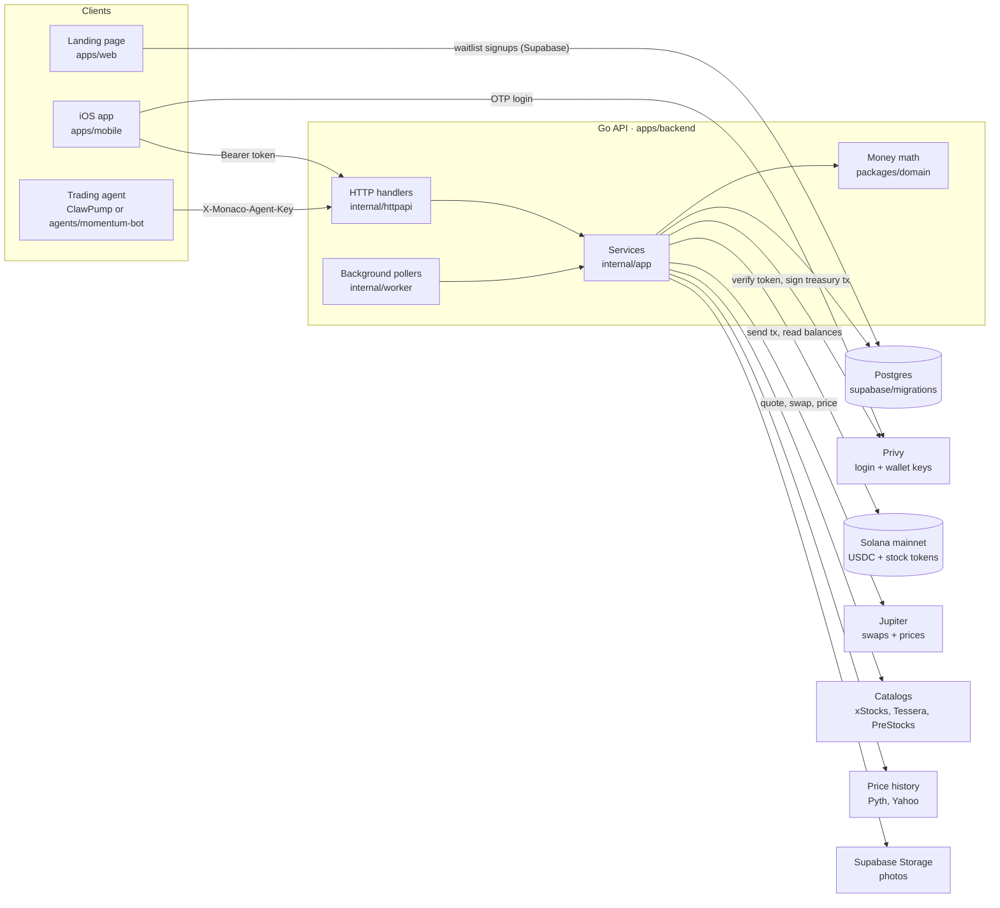
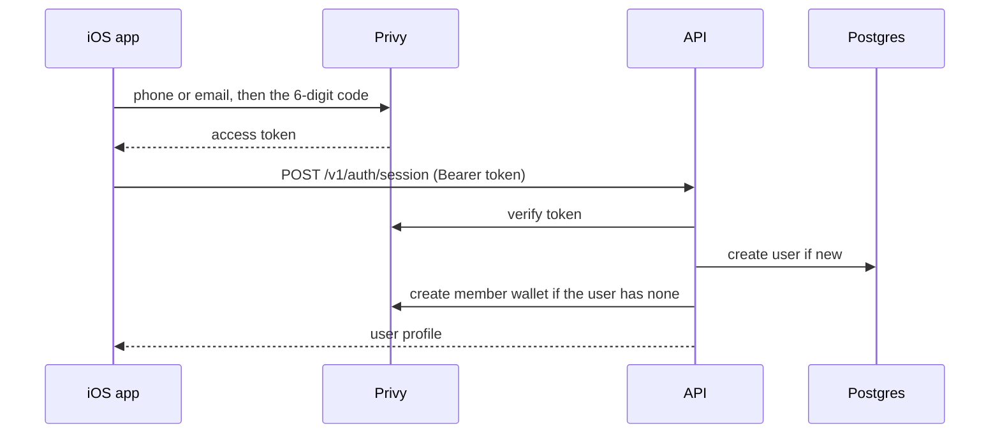
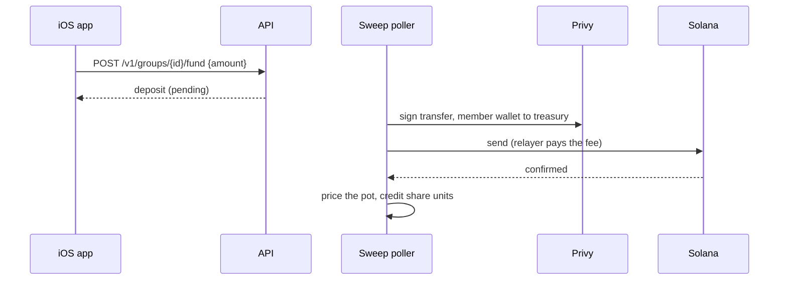
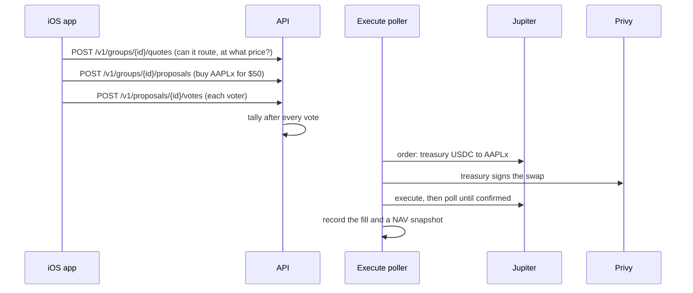

# Architecture

How Monaco is built: the parts, the outside services it uses, and how money moves through them. Read [product.md](product.md) first if you want the rules from the user's side (what a cabal is, how shares and votes work).

## In one paragraph

An iOS app talks to one Go API over HTTP. The API keeps the books in Postgres (members, share units, votes, trades) and keeps the money on Solana mainnet, in wallets that Privy holds the keys for. Every member has one Privy wallet, and every cabal has one Privy treasury wallet. When a vote passes or an agent sends a valid trade, the API swaps the treasury's USDC for a tokenized stock on Jupiter, and Privy signs for the treasury. An app-owned "relayer" wallet pays every Solana fee, so users never need SOL. There is no custom on-chain program: Solana holds the assets, and Postgres holds who owns what share of them.

## System map



Two rules hold everywhere:

1. **The phone only talks to Privy and the Monaco API.** It never calls Jupiter, Solana, a catalog, or a price feed. Everything it shows comes from the API.
2. **Only the API moves money.** Users never sign a Solana transaction. The API asks Privy to sign for member wallets and treasuries, and the relayer pays the fee.

## Repo map

| Path | What it is | Language |
| --- | --- | --- |
| `apps/backend` | The API server, background pollers, and ops commands | Go |
| `apps/mobile` | The iOS app (SwiftUI, iOS 18+) | Swift |
| `apps/web` | Waitlist landing page for trymonaco.xyz. Static HTML plus two serverless functions. See its [README](../apps/web/README.md). | JS |
| `packages/domain` | Pure money math: share units, NAV, votes, P&L, agent budgets. No database, no network. | Go |
| `packages/mobile-core` | Swift logic the app uses that can be tested on a Mac without a simulator: API client, JSON models, formatting, copy | Swift |
| `agents/momentum-bot` | Reference trading agent: reads prices, applies one rule, sends a trade | Go |
| `supabase/migrations` | SQL schema, applied in filename order when the API boots | SQL |
| `scripts` | Dev scripts behind the `just` recipes: env loading, simulator, database, QA | Bash |
| `docs` | These docs | |

Go and Swift share no code. **The HTTP API is the contract**: Go response structs and Swift `Codable` models are written by hand to match, and tests on both sides catch drift. The route list is in [api.md](api.md).

## Outside services

Every third party Monaco depends on, what it does, and what happens without it.

| Service | Used for | Where in code | Config | Required? |
| --- | --- | --- | --- | --- |
| **Solana mainnet** | Where the money lives. Cash is USDC (mint `EPjFWdd5AufqSSqeM2qN1xzybapC8G4wEGGkZwyTDt1v`). Positions are tokenized stocks. | `internal/solana`, `internal/worker/solana_rpc.go` | `SOLANA_RPC_URL` (public endpoint if unset; use a paid one outside local dev) | Yes |
| **Privy** | Sign-in by SMS or email code. Holds the keys for every member wallet and cabal treasury, and signs for them when the API asks. | `internal/privy` (server), `Features/Auth` (app) | `PRIVY_APP_ID`, `PRIVY_APP_SECRET`, `PRIVY_VERIFICATION_KEY`, `PRIVY_APP_CLIENT_ID`, `PRIVY_AUTHORIZATION_*` | Yes |
| **Relayer wallet** | Not a service: an app-owned Solana keypair that pays every transaction fee. The API refuses to start if it holds 0.001 SOL or less. | `internal/config/relayer.go` | `RELAYER_PRIVATE_KEY` | Yes |
| **Postgres** | The ledger: users, cabals, share units, votes, trades, NAV history. Docker Compose locally, Supabase in a hosted setup. | `internal/postgres` | `DATABASE_URL` | Yes |
| **Jupiter** | Swaps treasury USDC for stock tokens and back (Swap API v2). Also a price source and chart candles. | `internal/jupiter`, `internal/jupitercharts` | `JUPITER_API_KEY` (optional; higher rate limit) | Yes |
| **xStocks** | Catalog of tokenized US stocks (`AAPLx`, `TSLAx`, …): symbol to Solana mint address. Metadata only; trades still go through Jupiter. | `internal/xstocks` | none | Yes |
| **Tessera, PreStocks** | Catalogs of pre-IPO tokens (SpaceX, OpenAI, …). Same buy and sell path as stocks. | `internal/tessera`, `internal/prestocks`, `internal/catalog` | `TESSERA_ENABLED`, `PRESTOCKS_ENABLED` (both on by default) | No |
| **Pyth Hermes** | First choice for live stock marks when valuing a pot. Needs an equity-entitled key. | `internal/pyth`, `internal/pricechain` | `PYTH_API_KEY` | No. Without it, marks come from Jupiter. |
| **Yahoo Finance** | Chart history for the underlying stock (the default chart source). | `internal/yahoocharts` | `CHART_SOURCE=yahoo` (default) or `jupiter` | No |
| **Definitive Flash** | Alternative swap venue. Off by default. | `internal/flash`, `internal/swapprovider` | `SWAP_PROVIDER=flash`, `FLASH_API_KEY` | No |
| **Supabase Storage** | Stores profile photos and cabal pictures. | `internal/storage` | `SUPABASE_URL`, `SUPABASE_SERVICE_ROLE_KEY` | No. Photo upload is off without it. |
| **ClawPump** | Runs trading agents. Monaco never talks to it; ClawPump's agent calls the Monaco API. | none | `PUBLIC_API_BASE_URL` (the URL agents are told to call) | No |
| **Sentry, alert webhook** | Error reports and money alerts. | `internal/telemetry` | `SENTRY_DSN`, `ALERT_WEBHOOK_URL` | No. See [ops-observability.md](ops-observability.md). |

The full env list with comments is in `.env.example`.

## Wallets

Four kinds of wallet appear in this repo. Only the first three are part of the product.

| Wallet | How many | Keys held by | Holds | Job |
| --- | --- | --- | --- | --- |
| **Member wallet** | One per user | Privy (the API can sign) | USDC | The user's deposit address. USDC sitting here is their **account balance**. |
| **Treasury** | One per cabal | Privy (app-owned) | USDC and stock tokens | The cabal's shared pot. Every trade and every cash out signs from here. |
| **Relayer** | One per environment | The API (`RELAYER_PRIVATE_KEY`) | SOL | Pays fees for every transaction, so the other wallets never need SOL. |
| Phantom agent wallet | One per developer | A coding agent's Phantom MCP | USDC, SOL | **Not product.** Used to fund test accounts with real USDC during QA. See the [README](../README.md#agent-qa-phantom-mcp). |

## Backend

### Layers

A request passes through three layers, and each one has a single job:

1. **`internal/httpapi`**: parses the request, checks the Privy token or agent key, applies rate limits and idempotency, and turns errors into status codes. No business rules.
2. **`internal/app`**: the services that run each flow (deposits, governance, swaps, cash out, agents, home screens). They call Postgres, Privy, Jupiter and the catalogs through interfaces, so tests can swap in fakes.
3. **`packages/domain`**: the math every service shares: how many shares a deposit buys, what a cash out pays, whether a vote passed, whether an agent trade fits its budget. Pure functions on integers.

Everything is wired together in one place, `apps/backend/cmd/api/main.go`. Start there to see which implementation backs each interface.

### Background pollers

Four loops run inside the API process, next to the HTTP server:

| Poller | Every | Does |
| --- | --- | --- |
| Deposit sweep | 3 s, and right after a fund request | Moves the requested USDC from a member wallet to the cabal treasury, waits for Solana to confirm, then credits share units. Also reconciles USDC someone sent straight to a treasury address. |
| Proposal execute | 15 s | Finds passed proposals with no confirmed swap and runs the swap. |
| Cash-out recovery | 1 min | Finishes or rolls back a cash out the API was in the middle of when it stopped. |
| Spark warmer | 5 min | Pre-loads the popular stocks' day charts so list screens never wait on a price vendor. |

Each money poller records a transaction's signature before it broadcasts, so a crash or a retry finishes the first transaction instead of sending a second one.

### Modules at a glance

| Package | Job |
| --- | --- |
| `cmd/api` | The API server: startup checks, wiring, routes |
| `cmd/migrate`, `cmd/print-relayer-pubkey`, `cmd/sweep-member-to-address`, `cmd/seed-demo`, `cmd/faker-seed` | Ops and dev commands behind `just` recipes and scripts |
| `internal/app` | Business services (one file per flow: `deposit.go`, `governance.go`, `swap.go`, `redeem.go`, `agent_intent.go`, …) |
| `internal/httpapi` | Handlers, auth, rate limits, idempotency |
| `internal/postgres` | SQL queries, migrations runner, test database setup |
| `internal/worker` | The pollers above |
| `internal/privy` | Privy client: verify tokens, create wallets, sign transactions |
| `internal/solana` | Keys, signing, balances, mint info |
| `internal/jupiter`, `internal/flash`, `internal/swapprovider` | Swap venues behind one `Provider` interface |
| `internal/xstocks`, `internal/tessera`, `internal/prestocks`, `internal/catalog` | The asset catalog: search, symbol to mint, best issuer |
| `internal/pricechain`, `internal/pyth`, `internal/jupitercharts`, `internal/yahoocharts` | Marks for valuing pots, and chart history |
| `internal/marketcal` | NYSE/Nasdaq calendar (open, closed, after hours) |
| `internal/storage`, `internal/imageupload` | Photo uploads |
| `internal/telemetry`, `internal/ratelimit`, `internal/logsnippet` | Metrics and alerts, rate limits, safe log excerpts |
| `internal/demochain`, `internal/faker`, `internal/seeddemo` | Fake money and fake data for demos (see [Run modes](#run-modes)) |

## Data model

Tables live in `supabase/migrations`. The ones that matter for understanding the product:

| Table | Holds |
| --- | --- |
| `users`, `member_wallets` | One row per person, and their one Privy wallet |
| `groups`, `treasuries` | One row per cabal, and its treasury wallet |
| `group_members`, `group_voters`, `group_join_requests` | Who is in each cabal, who can vote, who is waiting to join |
| `positions` | Each member's share units in each cabal. **This is who owns what.** |
| `deposits` | Each fund request, from created to swept to credited |
| `proposals`, `votes`, `proposal_comments` | Trade and agent proposals, ballots, discussion |
| `transactions` | Each treasury swap (buy or sell), with its signature and status |
| `redeem_jobs`, `redeem_payouts`, `withdrawals` | Cash outs from a cabal back to the account balance |
| `platform_withdrawals` | USDC sent from the account balance to an outside address |
| `nav_snapshots` | Pot value after every deposit, fill and cash out. Charts and leaderboards replay these. |
| `group_agents`, `agent_intents`, `group_agent_key_reveals` | Trading agents, every trade they sent, and key access |
| `group_messages` | Cabal chat |
| `idempotency_keys` | Stored responses for retried money requests |
| `waitlist` | Landing page signups |

Postgres never holds money. It holds claims on the money in the treasuries.

## Flows

Each flow below is the path one user action takes through the system. The same service code runs whether a person or an agent starts it.

### Sign in



The API sees nothing until the code is accepted. A user always keeps the same member wallet; login never makes a second one.

### Deposit and fund a cabal

Money reaches a cabal in two separate steps.

1. **Deposit.** The user copies their member-wallet address from the app and sends Solana USDC to it from anywhere (an exchange, Phantom). Nothing else happens: the USDC sits in their wallet and shows as **account balance** (`GET /v1/me/balance`: on-chain USDC minus money already on its way somewhere).
2. **Fund.** The user picks a cabal and an amount. The sweep poller moves exactly that amount into the treasury and credits share units once Solana confirms.



Shares are credited only after the transfer confirms, and only once per transaction signature. Shares are priced at the pot's current value, so a new member never takes earlier members' gains ([the math](product.md#shares-and-pot-value)).

### Propose, vote, trade



- Only a member of the cabal's voter set can propose or vote.
- A buy is refused up front if Jupiter cannot route it, or if it is bigger than the whole pot.
- A proposal passes by majority or unanimously (the cabal's rule), or dies at its expiry.
- The stock tokens land in the treasury. A failed swap can be retried with `POST /v1/transactions/{id}/retry`.
- Sells work the same way. Proposals can also add, pause, resume or remove an agent.

### Agent trade

A cabal votes an agent in with a USDC budget and gets an API key. From then on:

```mermaid
sequenceDiagram
  participant Agent
  participant API
  participant Jup as Jupiter
  participant Privy
  Agent->>API: GET /v1/agent (budget, cash, holdings)
  Agent->>API: GET /v1/agent/assets (prices)
  Agent->>API: POST /v1/agent/intents {side, symbol, usd}
  API->>API: check key, status, budget; reserve the amount
  API->>Jup: same swap path as a passed vote
  API->>Privy: treasury signs
  API-->>Agent: fill
```

The agent never holds money or keys to the treasury. Its trades land in the treasury next to the members' trades and show in the cabal's activity feed. Over-budget trades are refused, never partly filled. Details: [agent-trading.md](agent-trading.md). Setup: [how-to/connect-an-agent.md](how-to/connect-an-agent.md).

### Cash out and withdraw

These are also two separate steps, mirroring deposit and fund.

1. **Cash out** (`POST /v1/groups/{id}/withdraw-to-balance`): the member sells some or all of their share units back to the cabal.
   1. Their share units are debited first.
   2. If the treasury is short of USDC, their slice of the holdings is sold on Jupiter.
   3. USDC equal to their slice of the pot goes from the treasury to their member wallet.
   4. If the API stops partway, the recovery poller finishes the payout or returns the shares. It never pays twice.
2. **Withdraw** (`POST /v1/me/withdrawals`): USDC moves from the account balance to any Solana address the user pastes.

Leaving a cabal (`POST /v1/groups/{id}/leave`) can cash out the whole stake in the same step.

### Valuing a pot

Every screen, every share credit and every cash out values the pot the same way (`valuePot` in `internal/app/pot_valuation.go`):

- **Pot value** = the treasury's USDC that the ledger can account for, plus each holding times its current mark.
- **Marks** come from a chain of sources, each tried in order: Pyth, then Jupiter's price for the token. A source that keeps failing is skipped for a while (`internal/pricechain`).
- Anything that moves money needs a live mark. With none, the fund waits and retries, and a cash out fails with the shares returned. Screens may fall back to the purchase price so they still render.

## Run modes

| Mode | Turn on with | What changes |
| --- | --- | --- |
| Normal | default | Real Privy, real Solana mainnet, real USDC |
| Demo money | `DEMO_MODE=1` | Real sign-in and wallets, but balances, fills and cash outs live in memory. Nothing reaches Solana. Resets on restart. |
| Fake data | `just faker <profile>` or `just seed demo` | Fills local Postgres with fake cabals, members, trades and history so screens look alive. Fake rows are flagged and every money path skips them. See the [README](../README.md#demo-data-faker-seed). |
| Flash swaps | `SWAP_PROVIDER=flash` | Treasury swaps go through Definitive Flash instead of Jupiter. Quotes shown in the app still come from Jupiter. See the [README](../README.md#swap-provider-jupiter-or-definitive-flash). |

## Safety properties

What the design guarantees, and where each guarantee lives:

| Guarantee | How |
| --- | --- |
| Money is never credited or paid twice | Every transfer's signature is stored before it is broadcast. Pollers lease rows (`FOR UPDATE SKIP LOCKED`), so two API instances never sweep the same deposit. |
| A retried request never repeats a trade | Money routes take an `Idempotency-Key` header; agent trades take an `idempotencyKey` field. See [api.md](api.md). |
| A new member cannot take existing gains | Shares are priced at the current pot value (`packages/domain/shares.go`). Rounding always favours the pot. |
| An agent cannot overspend | Its budget is checked and reserved under a row lock before each swap (`domain.ValidateIntent`). It can only sell what it bought. |
| Non-members see nothing | Every cabal route checks membership. Covered by `multi_user_authz_test.go` ([multi-user-verification.md](multi-user-verification.md)). |
| The phone cannot move money on its own | All signing happens on the server through Privy. |

## Known limits

- **Custodial.** The API can sign for every treasury. That was accepted for the demo.
- **One API instance is the tested setup.** The deposit sweep poller is safe with several instances; the execute and cash-out pollers have not been tested that way.
- **No deploy pipeline yet.** The API is one Go binary; what a host needs is in the [README](../README.md#deploy).
- **Legal.** Tokenized stocks are on-chain trackers, not shares held at a broker. Pooled custody raises broker-dealer, adviser and money-transmitter questions in the US. A public launch needs counsel first.
