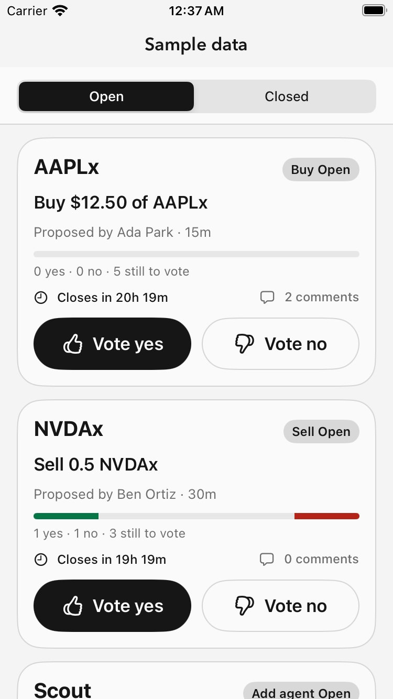
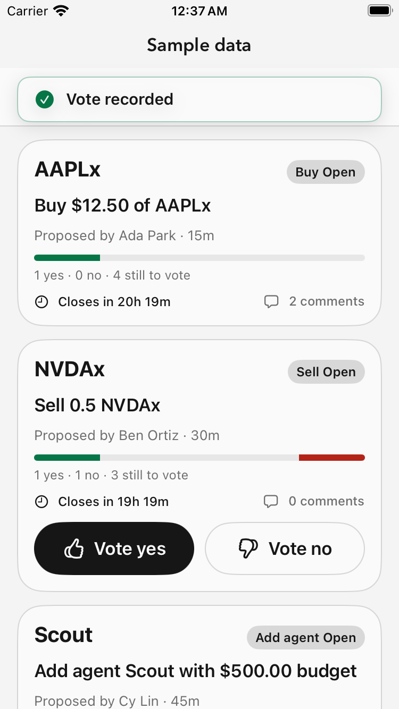
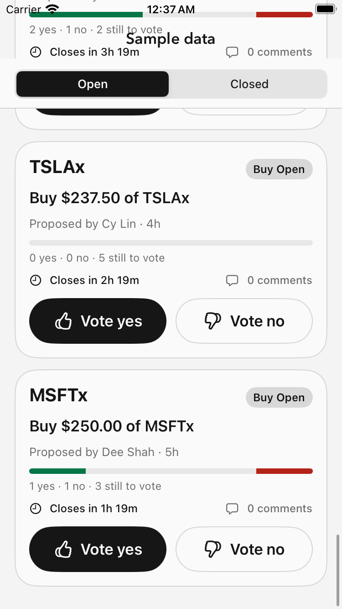
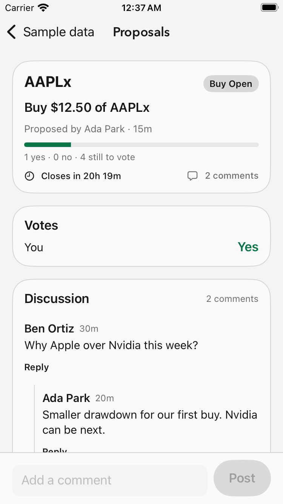
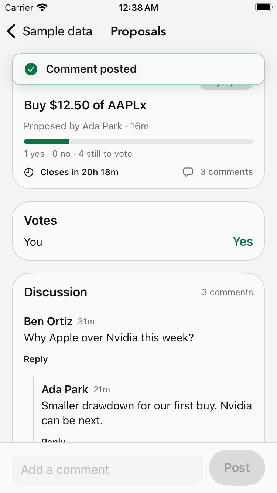
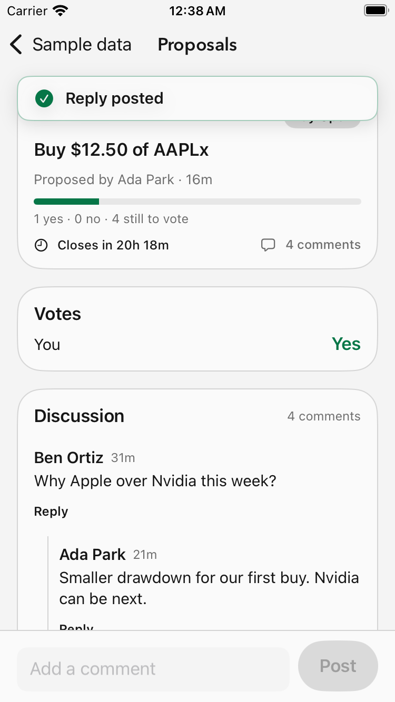

# Proposal feed and comments verification

Issue #149. Base: `main` (after propose-sell #194 and agent trading #202, profile #201). Adds `proposal_comments` (migration 000014), `GET/POST /v1/proposals/{id}/comments`, feed card fields on the group proposal list (`canVote`, `voteSummary`, `commentCount`), `commentCount` on detail, and the SwiftUI card feed, detail thread, and composer. Cards and detail render both sides: "Buy $12.50 of AAPLx" and "Sell 0.5 NVDAx" (token amount at 8 decimals), with a Buy/Sell status chip. Agent governance proposals from #202 render with the agent's name as the card title and main's copy ("Add agent Scout with $500.00 budget", "Pause the cabal trading agent"); detail keeps the agent section and one-time API key reveal.

## Verified

- Backend suite passes with `go test -vet=off -p 1 ./...` on a dedicated local Compose Postgres database (`monaco_190r_test`) and fake Privy/Jupiter providers, The one failure, `TestOpenTestDB_connectsToDerivedDatabase`, hard-codes the shared `monaco_test` name. Domain tests pass.
- Comment HTTP tests cover: member post and reply, oldest-first thread with `parentId`, empty thread, non-member 404 on list and post (no text leaked), missing auth 401, whitespace-only / missing / over 1,000 code points / over the 16 KiB byte cap / NUL / malformed JSON / malformed or unknown parent id bodies (400, nothing stored), exactly 1,000 code points accepted, reply to a comment on another proposal 400, unknown or malformed proposal id 404, 11th comment in a minute 429 with `Retry-After`, and list/detail card fields before and after voting.
- 127 host mobile-core tests pass (`swift test`): DTO decoding (feed card, legacy list payload, detail), comment decode, thread nesting, orphan and cycle handling, draft length rule, formatters (sell share counts, buy/sell/agent headlines, agent DTO fields), feed copy audit, client paths, bodies, and error statuses.
- Native Debug simulator build passes with a public compile-only Privy configuration.
- XCUITest `ProposalFeedSampleUITests` passes on the SimSlim-prepared simulator (iOS 18.0) using the Debug-only `-MonacoProposalFeedSample` launch argument, which swaps in an in-memory service. The sample feed includes a sell proposal and an add-agent proposal. It votes yes from a card, scrolls through 20 open cards, opens the thread, posts a comment, replies to a comment, and checks that Post stays disabled for a whitespace-only draft. Screenshots below come from that run.

## Still required before merge

Live authenticated walkthrough on the local backend: two members, A proposes, B comments, A replies, both vote, feed counts update. The current environment key does not decrypt the shared environment, so no Privy sign-in was possible. Sample data proves the SwiftUI flow and the shared vote path, not the live HTTP contract; the contract is covered by the Go handler tests and the mobile-core client tests.

## Screens (sample data)

| | |
|---|---|
|  |  |
|  |  |
|  |  |
