# Solana line redesign — QA gallery

Shot on an iPhone 17 Pro simulator, iOS 26.3, from the Debug sample harnesses (`scripts/qa/screens.sh`) unless marked live. `before` is `integrate/solana-ui` at `ed77437f` plus #441; `after` is `feat/solana-redesign`, rebased onto `integrate/solana-ui` at `30fdda35` (the pre-IPO tokens and the trading agents). Tokens and rules: [`docs/design.md`](../../design.md).

| Screen | Before → after |
| --- | --- |
| Home | 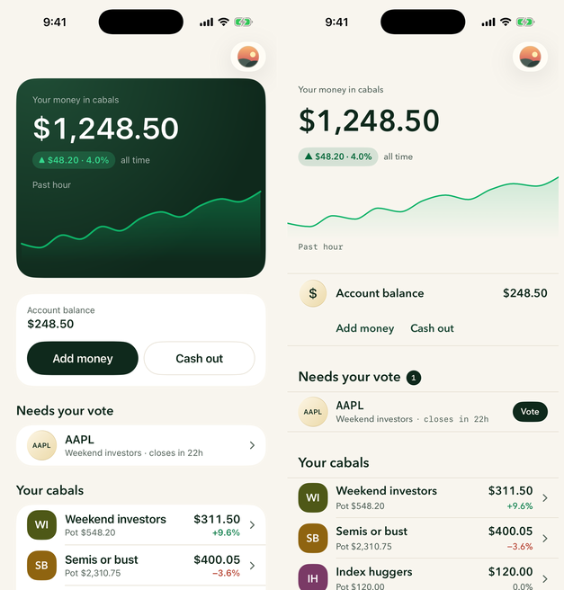 |
| Cabal | 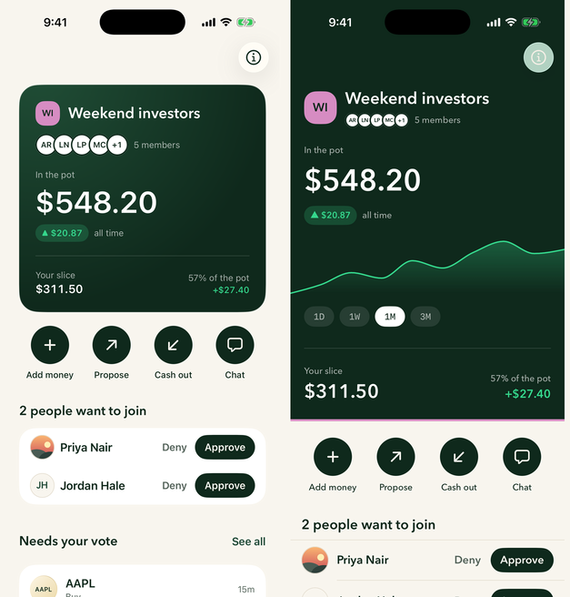 |
| Cabals tab | 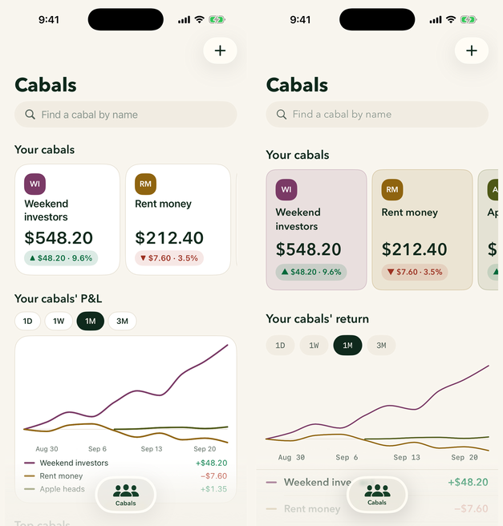 |
| Stocks tab | 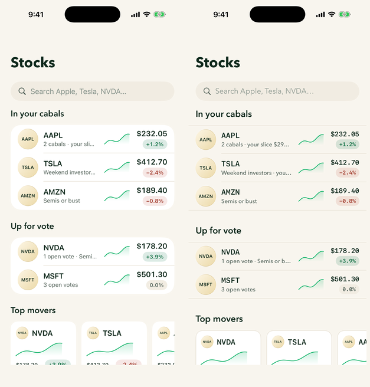 |
| Stock | 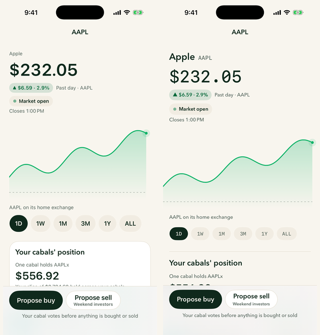 |

The second pass, lane by lane (before is the same base; after is the branch after the lanes and the rebase onto the pre-IPO and agent work):

| Screen | Before → after |
| --- | --- |
| Cash out of a cabal | 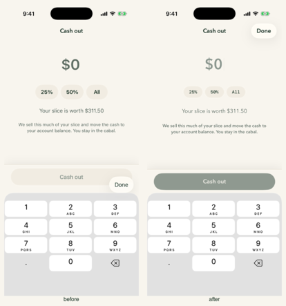 |
| Receipt | 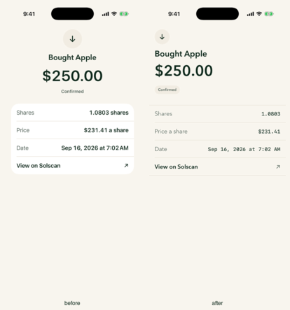 |
| Propose | 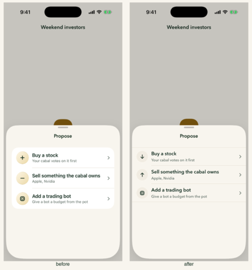 |
| Proposal | 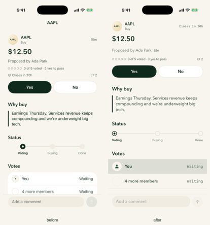 |
| Chat | 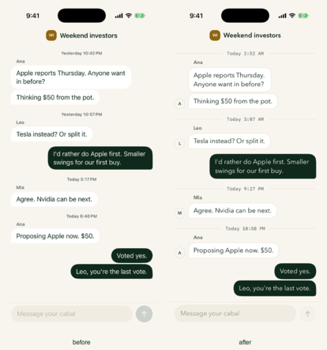 |
| Onboarding | 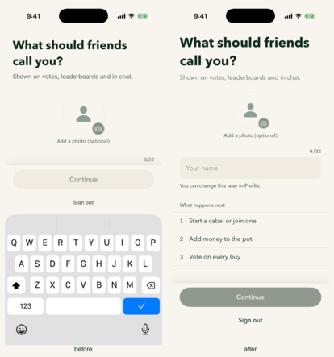 |
| Start a cabal | 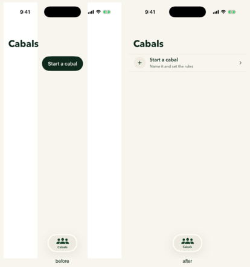 |
| Cabal details | 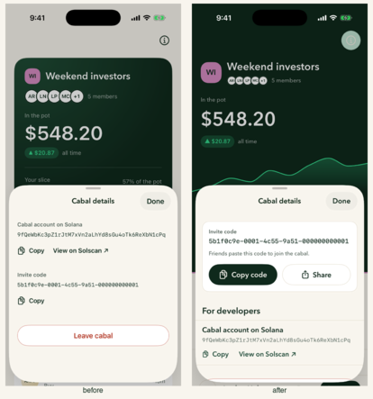 |
| Stock, with cabals | 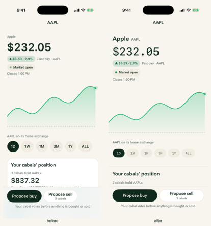 |
| Stocks tab | 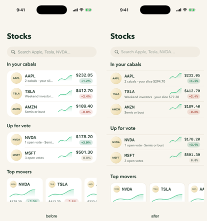 |

Signed in against the integration backend (fixed-OTP test account), then dark mode and an accessibility text size:

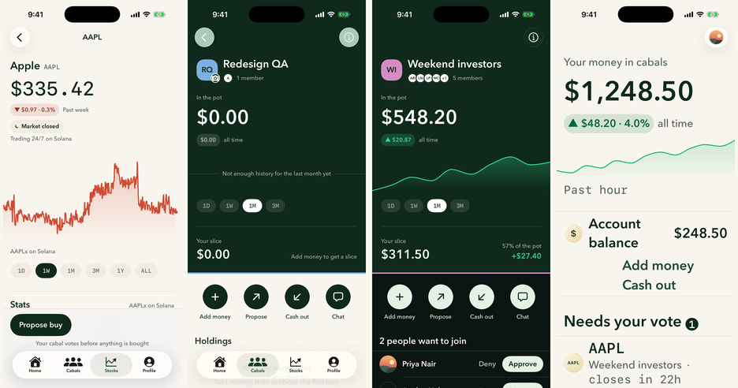

Left to right: a real Jupiter-candle chart for AAPLx over one week in the signed-in app; a cabal created live, with the per-cabal history read answering "not enough history yet"; the cabal screen in dark; Home at the accessibility-large text size.
