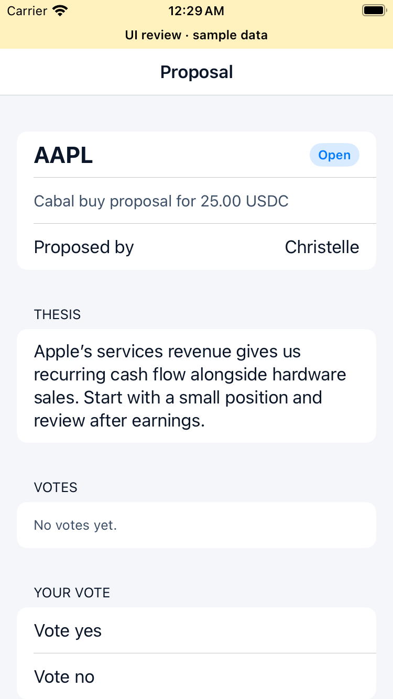

# Proposal thesis verification

Issue #145. Base: `main`. Optional trimmed rationale on proposal create and detail; maximum 2,000 Unicode code points. The list endpoint is unchanged. Existing proposals default to an empty thesis.

## Verified

- 42 host mobile tests pass, including request encoding, detail decoding, and legacy payload compatibility.
- Native Debug simulator build passes with public compile-only Privy configuration.
- Backend app/HTTP tests cover trimmed and multiline text, 2,000 Unicode characters, omitted/blank values, second-member access, no thesis in list responses, and over-limit rejection without an insert.
- Full backend runtime suite passes with `go test -vet=off -p 1 ./...` against a dedicated local Postgres and fake providers. Domain tests pass.
- XCTest verifies the detail screen renders the thesis above votes, using a separate labeled sample-data app on the SimSlim-prepared simulator.

## Still required before merge

Real authenticated create → detail → second-member viewing on the local backend, plus an over-limit submission in the app. The current environment key does not decrypt the shared environment; compile-only config and fixtures do not verify live auth.

Default backend vet has a pre-existing failure: Jupiter benchmarks use `testing.B.Context` but the module declares Go 1.23. Runtime testing with vet disabled is supplemental, not a passing default gate. Re-run the standard environment-dependent `just` gates with working credentials.

## Sample-data detail

