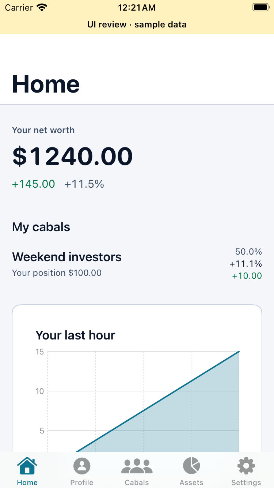
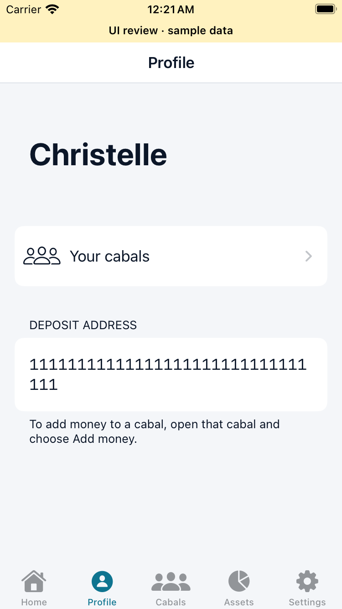
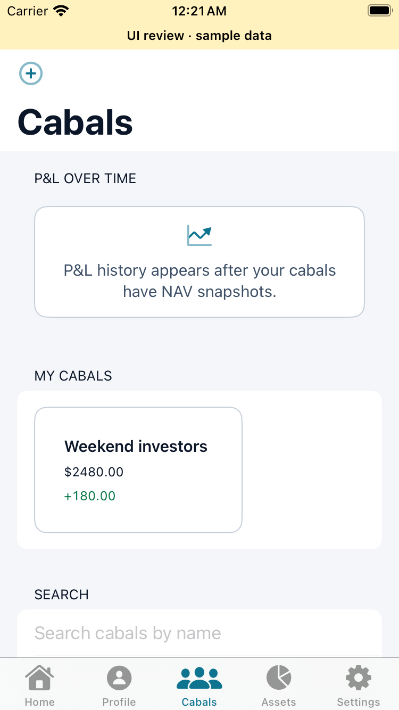
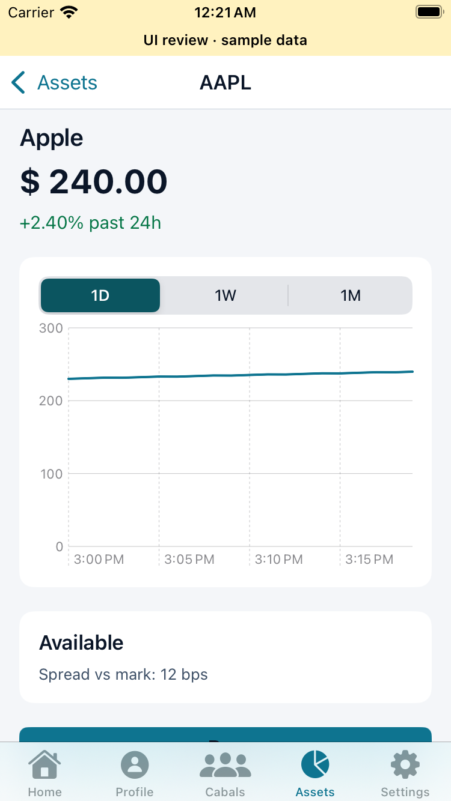

# Tab shell verification

Issue #177. Base: `oh-yea`. Keeps the existing Monaco theme.

## Verified

- `just test mobile`: 53 passing tests on the isolated issue branch, including six refresh lifecycle regressions.
- Native Debug simulator build: passed with public test Privy configuration (compile only).
- `just build backend`: passed.
- Backend runtime suite: passed against a dedicated local Postgres with fake providers using `go test -vet=off -p 1 ./...`.
- Production mux smoke test checks registered routes and unauthenticated rejection without provider calls.
- Two XCTest fixture walkthroughs pass: Home → Profile → Cabals → Assets → Apple → Buy → cabal picker → Settings; onboarding tour skip → Home.
- SimSlim applied; sample-data screenshots below. Fixture walkthrough used the same shell changes with current main's auth configuration fixes; it does not exercise real authentication. A separate native build and host suite verify the issue-only branch.

## Still required before merge

- A matching environment key for the current encrypted environment, then real OTP, required username onboarding, authenticated API smoke, create/join/leave refresh, deposit settlement refresh, and logout.
- Standard `just build mobile` and `just test backend` wrappers with the decrypted environment. Local verification used an isolated database and compile-only public configuration.
- Default backend vet fails in the existing Jupiter benchmark: `testing.B.Context` requires Go 1.24 while the module declares 1.23. Runtime tests with vet disabled are supplemental, not a passing default gate.

## Sample-data screens

These images are visual evidence only. No real account or money movement was exercised.

| Home | Profile |
|---|---|
|  |  |

| Cabals | Asset detail |
|---|---|
|  |  |
