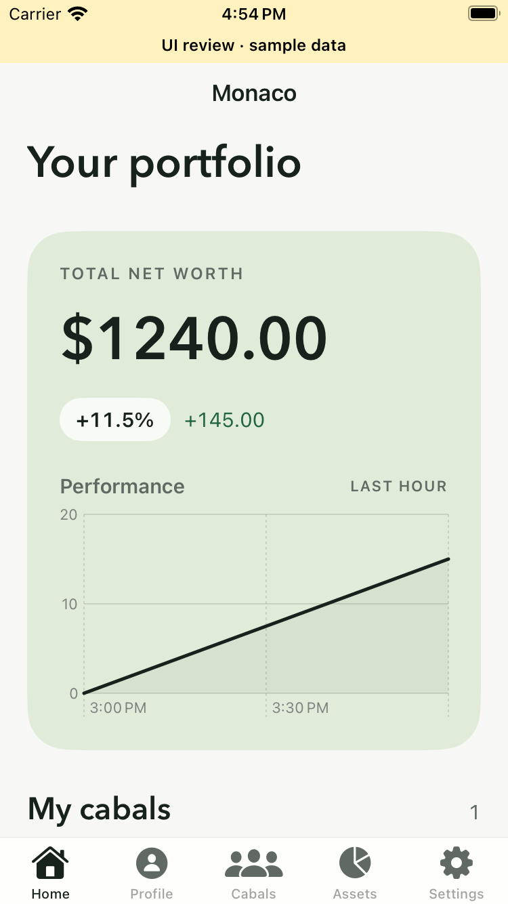
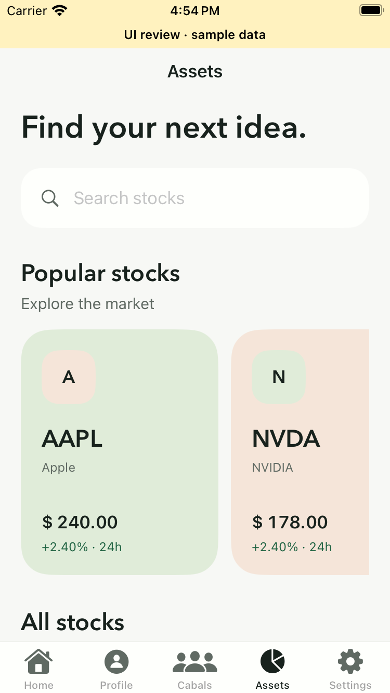
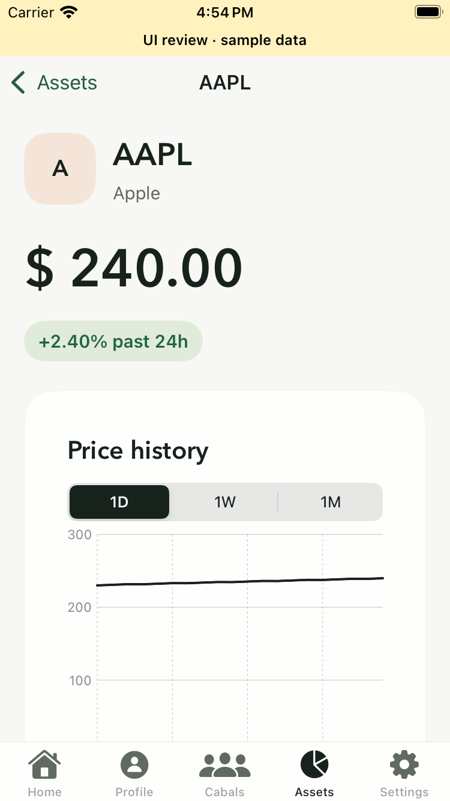
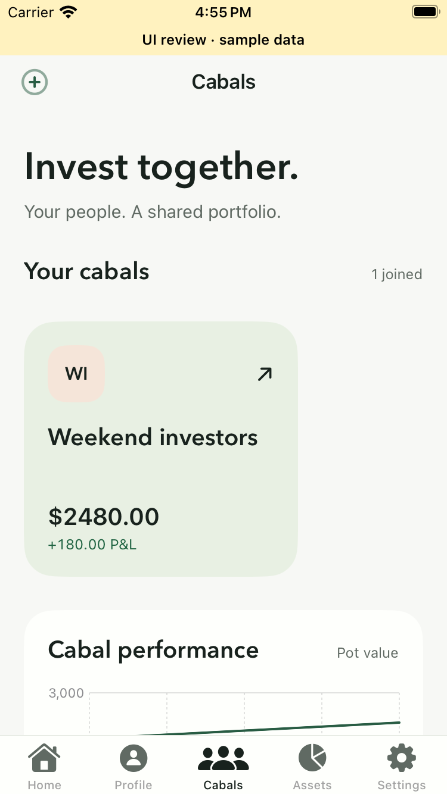
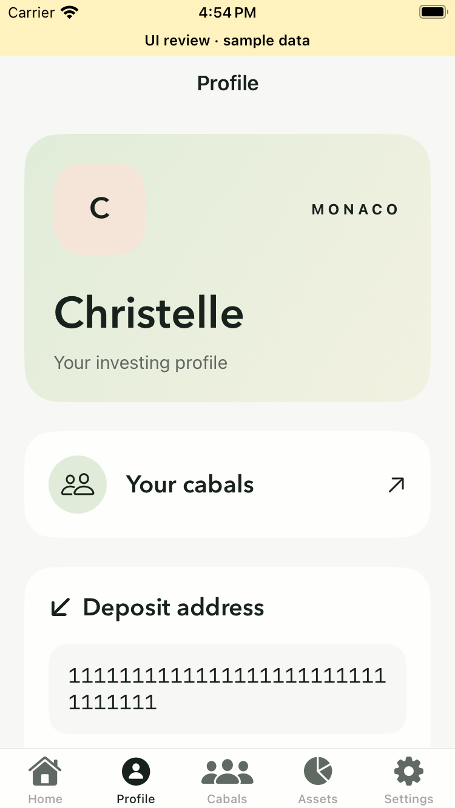
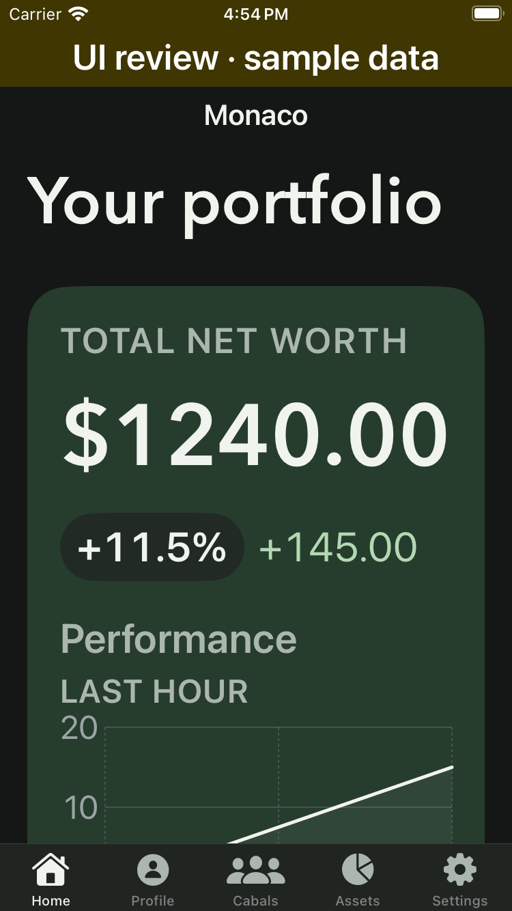
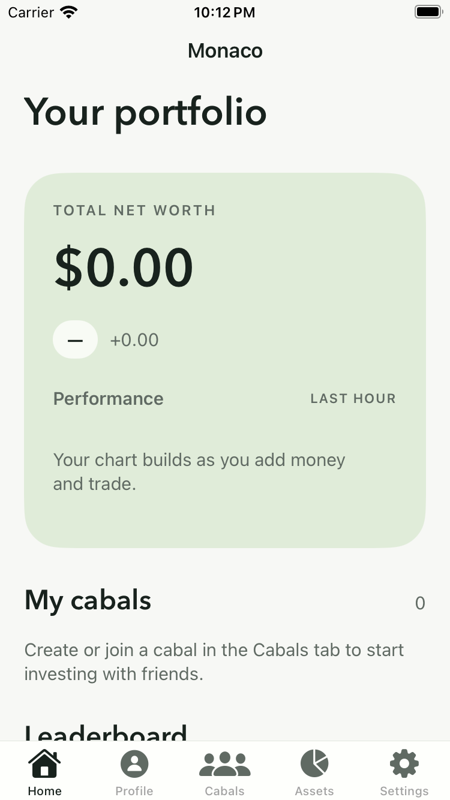
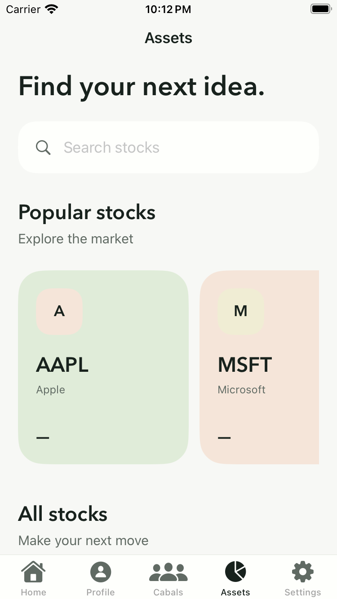

# Mobile design review

Issue #191. Inspired by [Orbix Studio’s Food Delivery Mobile App](https://me.muz.li/orbix-studio/food-delivery-mobile-app).

## Design

Warm paper and ink replace the navy/teal chrome. Avenir Next headings, rounded portfolio/cabal/stock cards, restrained mint and peach surfaces, and pill actions adapt the reference to investing. Initial marks are typographic identities, not fake avatars or company logos. Chart values and portfolio balances remain API-driven.

Shared styles live in `MonacoTheme`, `MonacoAppearance`, and `MonacoIdentityMark`. Existing tabs, view models, authentication, API contracts, and refresh paths are retained. Unavailable stocks cannot enter the Buy flow. Numeric balance transitions and button springs respect Reduce Motion; native tabs provide selection haptics.

## Verification

- 53 host mobile tests pass.
- Native simulator build passes with the working encrypted environment.
- SimSlim disables 110 background services; required keychain, universal-link, and push checks pass.
- Three fixture XCTest scenarios pass: five tabs/stock detail/buy picker, onboarding tour, and dark appearance with accessibility text size on Home/Profile.
- Reviewed and corrected full-row tap areas, fitting of identity initials, distinct chart colors, and large-text chart/leaderboard layouts.
- No backend changes. Screenshots are from a separate, visibly labeled sample-data build. They verify UI rendering/navigation, not real authentication or financial execution.

## Follow-up verification

- Re-ran all 53 host mobile tests: zero failures.
- Backend binary builds. Tooling tests (`go test -short ./...` in `scripts`) pass.
- All backend packages pass against an isolated local Postgres with the Go declaration correction from #183 applied through a temporary `-modfile`; vet remains enabled. The unmodified branch still fails vet because it declares Go 1.23 while Jupiter tests use Go 1.24 APIs. The correction stays in its own PR.
- Live smoke passed twice with zero failures: first-login username onboarding, real email OTP, all five tabs, stock catalog, Apple detail, and sign-out. The final expanded run completed in 71 seconds.
- Added opt-in `LiveShellTests` for Privy test-account login, first-login username onboarding, all five tabs, and sign-out. Credentials are provided to XCTest through `TEST_RUNNER_MONACO_TEST_EMAIL` and `TEST_RUNNER_MONACO_TEST_OTP`; absent credentials explicitly skip this integration test.
- This stacked branch still needs the Privy configuration embedding fix already on main. Launch-time configuration is supplied through `scripts/with-ios-privy-env.sh`; for XCTest, forward the public Privy app/client settings with `TEST_RUNNER_` as well.

The live catalog and detail loaded stock identities, but price values were unavailable (shown as an em dash); the chart was still loading in the capture. Quote/chart availability remains unverified. No UI fixtures were used in the live test.

Live testing uses the existing local API on port 8080. Backend regression tests use a separate disposable Postgres database with fake providers. No deposits, trades, withdrawals, or funded settlement were executed; those financial flows are not certified by this design review.

### Re-run the live shell smoke

Start the local API first. Set `SIMSLIM_UDID`, `TEST_RUNNER_MONACO_TEST_EMAIL`, and `TEST_RUNNER_MONACO_TEST_OTP` for a dedicated Privy test account. The test saves `Alfred` as the username only if onboarding requires one.

```sh
scripts/with-ios-privy-env.sh bash -c '
  export TEST_RUNNER_PRIVY_APP_ID="$PRIVY_APP_ID"
  export TEST_RUNNER_PRIVY_APP_CLIENT_ID="${PRIVY_APP_CLIENT_ID:-$PRIVY_AUTH_ID}"
  export TEST_RUNNER_PRIVY_AUTHORIZATION_KEY_ID="$PRIVY_AUTHORIZATION_KEY_ID"
  exec xcodebuild -project apps/mobile/Monaco.xcodeproj -scheme Monaco \
    -destination "platform=iOS Simulator,id=$SIMSLIM_UDID" \
    CODE_SIGNING_ALLOWED=NO -only-testing:MonacoUITests/LiveShellTests test
'
```

## Before / after

| Previous Home | Redesigned Home |
|---|---|
|  |  |

## Screens

| Assets | Stock detail |
|---|---|
|  |  |

| Cabals | Profile |
|---|---|
|  |  |

### Dark appearance / large text



## Live API captures

These are from the real test account and local API, separate from the sample-data design screenshots above. The account has no holdings; missing prices are visible rather than replaced with sample values.

| Live Home | Live stock catalog |
|---|---|
|  |  |
