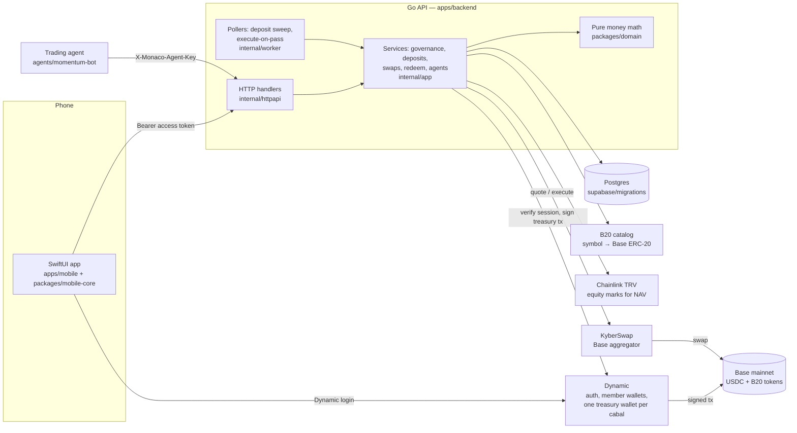

# Monaco — submission notes

Monaco is a hedge fund you run with friends. A group (a "cabal") pools USDC, members propose
and vote on trades, and passed trades execute for the whole pot. Each member owns shares of
the pot, so as it gains, their stake is worth more through NAV. A cabal can also vote in a
trading agent and give it a capped budget. Joining is just a deposit.

Every claim below points at the code that backs it. Where something is not built or not yet
run live, it says so.

## Architecture



- There is no custom on-chain program. Assets sit in Dynamic Base wallets: one per member, one
  treasury per cabal. Postgres is the ledger for shares, votes, and the transaction log.
- A dedicated relayer EOA pays Base fees, so members and treasuries never hold ETH
  (`internal/evm/constants.go`; the API refuses to boot if the relayer is under 0.002 ETH).
- The backend can sign for treasuries. That is custodial, and we accepted it for the hackathon.

## Vote → execution

1. A member posts a proposal (`POST /v1/groups/{id}/proposals`): kind `buy` or `sell`, a
   symbol, an amount. A buy is only accepted if Kyber can quote a route for it
   (`internal/app/start_buy.go`).
2. Members vote yes/no (`POST /v1/proposals/{id}/votes`). Every vote re-runs
   `domain.TallyProposal` (`packages/domain/votes.go`): **majority** passes once yes votes beat
   no votes plus everyone yet to vote, and fails once it cannot; **unanimous** fails on the
   first no. Proposals expire (24h by default). Defaults are all members vote, majority wins.
3. `ProposalExecutePoller` (`internal/worker`, every 15s) picks up passed proposals that have
   no confirmed swap and runs `ExecuteOnPass`: Kyber quote → treasury signature from Dynamic
   through the `TreasurySigner` interface → Kyber execute → poll until confirmed → write
   the transaction row. A failed swap can be retried with
   `POST /v1/transactions/{id}/retry`.
4. The fill shows up in the cabal's activity feed and holdings.

## NAV and shares

All of this is pure integer math in `packages/domain`, tested without a database.

- **Pot NAV** = treasury USDC + Σ (B20 units × mark), marks from Chainlink (`nav.go`,
  `internal/app/marked_pot.go`). **NAV per share** = pot NAV ÷ total shares, or $1.00 before
  any shares exist.
- **Deposit**: USDC is swept from the member's wallet to the treasury, then
  `shares minted = deposit ÷ NAV per share` (`shares.go`). Late joiners buy in at the current
  price and do not dilute earlier members.
- **Withdraw**: `payout = shares redeemed ÷ total shares × pot NAV` (`redeem.go`). Shares are
  debited first; if the treasury is short of USDC, the member's slice of holdings is sold; then
  USDC is paid to their wallet. The job is resumable if it dies midway (`internal/app/redeem.go`).
- A member's P&L is the current value of their shares minus their net USDC in.

## Agent trading

An agent is a program holding an API key for one cabal. It posts intents; Monaco executes
them through the same swap path a passed vote uses.

```
GET  /v1/groups/{id}/assets            list tradable symbols
POST /v1/groups/{id}/agents/intents    {"side":"buy","symbol":"GOOGLc","usdcMicros":1000000}
                                       {"side":"sell","symbol":"GOOGLc","tokenAmount":50000000}
Header: X-Monaco-Agent-Key
```

The reference agent is [`agents/momentum-bot`](../../agents/momentum-bot): standard-library Go,
one readable momentum rule, dry run by default. How to run it:
[`docs/how-to/connect-an-agent.md`](../how-to/connect-an-agent.md).

### Safety model

| Control | How it works | Code |
| --- | --- | --- |
| The cabal votes the agent in | `add_agent` is a proposal kind with the same tally as a trade. No vote, no key. | `packages/domain/votes.go`, `internal/app/agent_service.go` |
| Budget cap, enforced server-side | Each intent is checked against `allocation − executed buys − pending buys`, and against the treasury's USDC. Over budget is a `422`, never a partial fill. The bot's own caps are a second, inner limit. | `domain.ValidateIntent` in `packages/domain/agent.go` |
| Sells are bounded | An agent cannot sell more of a symbol than the cabal holds. | same |
| Pause, resume, revoke by vote | Paused: key stays valid, intents get `403`. Revoked: key gets `401`. | `internal/app/agent_intent.go` |
| Proposer-only key reveal | The key is minted when the vote passes and stored as a SHA-256 hash. The plaintext is readable by the proposer alone for 15 minutes, then purged. | `agent_key.go`, `ReadAgentKeyReveal` in `internal/postgres/group_agents.go` |
| Wrong-key throttling | 10 wrong keys per cabal or per address, then `429` with `Retry-After`, refilling one try per minute. Correct keys are never throttled. A key for another cabal gets the same `401` as an unknown key. | `internal/httpapi/agent_auth.go` |
| Audit trail | Every intent is stored, including rejected ones with the reason. Fills appear in the cabal activity feed marked as agent trades. | `InsertAgentIntent` |

Known limit: the key is five characters from a 31-letter alphabet so it can be typed on a
phone. That is roughly 28.6 million combinations; the throttle, not the key length, is what
makes guessing impractical.

## Tracks

### Definitive Flash — Best Social Trading Build

The social trading product is what is described above: shared pot, proposals, votes, chat
and comments on proposals, a cabal leaderboard, per-member P&L.

Flash status, stated exactly:

- Execution is **Kyber on Base**, not Jupiter. `SwapService` talks to the aggregator; vote
  execution, agent intents, and redeem sells share that path.
- Treasuries sign via Dynamic server wallets (signer sidecar), not Privy.

### Dynamic — Best Agentic Wallet or Payment Experience

What exists today: the agentic payment experience is the agent flow above. A group of people
votes to delegate a spending limit to software, the server enforces that limit on every
intent, and the group can pause or revoke it by vote.

What an "agent wallet" is today: a **budget-capped allocation of the cabal's Dynamic treasury**.
The agent has no wallet of its own. Its trades are signed by the same treasury wallet as member
trades, and its fills stay in the treasury.

The seam is the `TreasurySigner` interface in `apps/backend/internal/app/treasury_signer.go`.
Production signing goes through the Dynamic signer sidecar (`apps/signer`).

## Run it

Setup, commands, tests and deployment are in the [top-level README](../../README.md). CI
(`.github/workflows/ci.yml`) runs the Go and Swift suites on every pull request.
